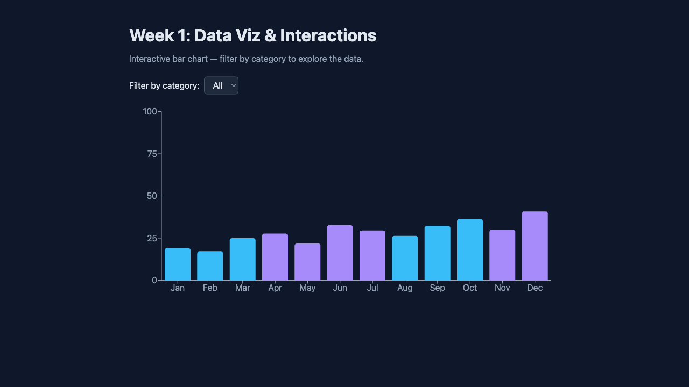

# Spring Into AI Build Sprint

Repo for the [Spring Into AI Build Sprint](https://advisoryhour.substack.com/p/spring-into-ai-competition-rules) (5 weeks, ship every week). Week 1: **ChartSlice** — a small interactive data viz.

## Week 1: ChartSlice

Interactive bar chart that lets you **slice the data by category**. Theme: data visualization and interactions.

**Live app:** [https://mf-spring-into-ai.vercel.app](https://mf-spring-into-ai.vercel.app)

### Screenshot



### How to run it

```bash
cd week1/data-viz-app
npm install
npm run dev
```

Open http://localhost:5173. See [week1/data-viz-app/README.md](week1/data-viz-app/README.md) for full details.

### Stack

React 18, Vite, Recharts.

---

- [Competition rules](https://advisoryhour.substack.com/p/spring-into-ai-competition-rules) · [FAQ & tips](https://advisoryhour.substack.com/p/faq-and-tips-on-competition)
