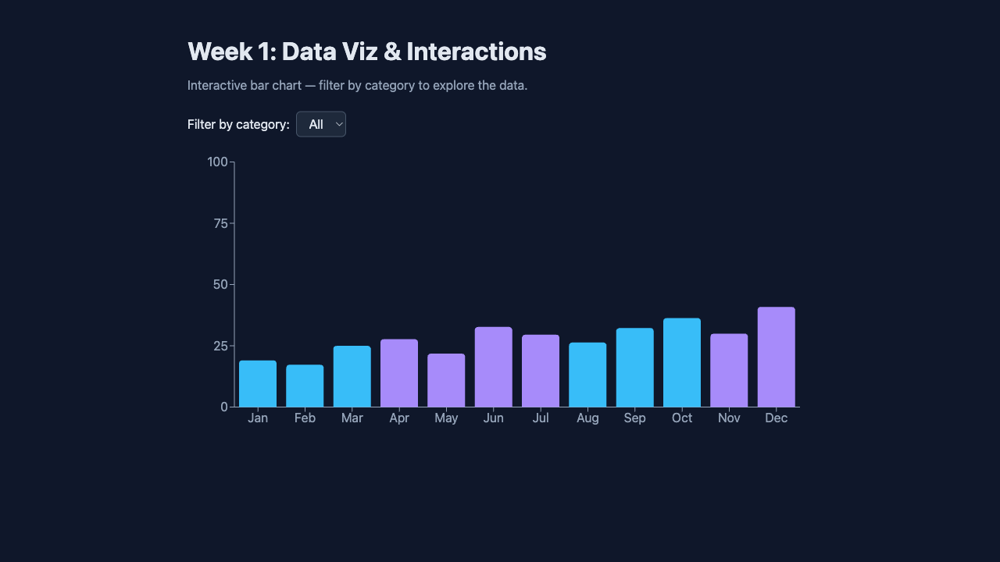

# Spring Into AI Build Sprint

Repo for the [Spring Into AI Build Sprint](https://advisoryhour.substack.com/p/spring-into-ai-competition-rules) (5 weeks, ship every week). Week 1: **ChartSlice** — a small interactive data viz.

## Week 1: ChartSlice

Interactive bar chart that lets you **slice the data by category**. Theme: data visualization and interactions.

**Live app:** [https://mf-spring-into-ai.vercel.app](https://mf-spring-into-ai.vercel.app)

### Screenshot



### How to run it

```bash
cd week1/data-viz-app
npm install
npm run dev
```

Open http://localhost:5173. See [week1/data-viz-app/README.md](week1/data-viz-app/README.md) for full details.

### Stack

React 18, Vite, Recharts.

## Week 2: Skill Directory

A **discovery API + landing page** for Agent Skills from the sprint. For humans: browse skills. For agents: `GET /api/skills` returns the list as JSON. Theme: build something for AI to use.

**Location:** [week2/skill-directory/](week2/skill-directory/)

- **Landing page:** Lists each skill (name, description, when to use, repo, demo).
- **API:** `GET /api/skills` — JSON array for agents to discover which skill to use.

Includes: sprint-helper (this repo), [seabass223/ai-skills](https://github.com/seabass223/ai-skills) (Azure SQL DTU Profiler), [JStrait515/crypto-agent-skill](https://github.com/JStrait515/crypto-agent-skill) (Crypto Market). See [week2/skill-directory/README.md](week2/skill-directory/README.md) for how to run and deploy.

**Also in Week 2:** [sprint-helper](week2/sprint-helper/) — Agent Skill that returns a random build idea in JSON (`node scripts/get-idea.mjs`).

---

- [Competition rules](https://advisoryhour.substack.com/p/spring-into-ai-competition-rules) · [FAQ & tips](https://advisoryhour.substack.com/p/faq-and-tips-on-competition)
