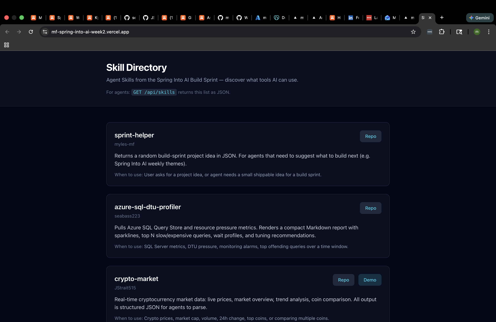

# Skill Directory

A **discovery API + landing page** for Agent Skills from the Spring Into AI Build Sprint. For humans: browse skills. For agents: `GET /api/skills` returns the list as JSON.

**Week 2 theme:** Build something designed for AI to use. This is infrastructure — the place agents (and humans) discover what skills exist.

## What it is

- **Landing page:** Lists each skill with name, description, "when to use," repo link, and demo link (if any).
- **API:** `GET /api/skills` returns the same data as JSON so an agent can call it to decide which skill to use for a task.

## How to run it

```bash
npm install
npm run dev
```

Open http://localhost:3000. API: http://localhost:3000/api/skills.

## Live app

**Live app:** https://mf-spring-into-ai-week2.vercel.app

API: https://mf-spring-into-ai-week2.vercel.app/api/skills

## Screenshot

Add a screenshot of the deployed landing page to `screenshots/directory.png` (or paste below). Example:



## Stack

Next.js 14 (App Router), TypeScript, Tailwind CSS.

## Skills listed

- **sprint-helper** (myles-mf) — random build-sprint idea in JSON
- **azure-sql-dtu-profiler** (seabass223) — Azure SQL metrics, top queries, tuning
- **crypto-market** (JStrait515) — live crypto prices, market overview, trends

To add a skill: edit `app/lib/skills.ts` and add an entry with `name`, `description`, `repo`, `when_to_use`, optional `demo` and `author`.
